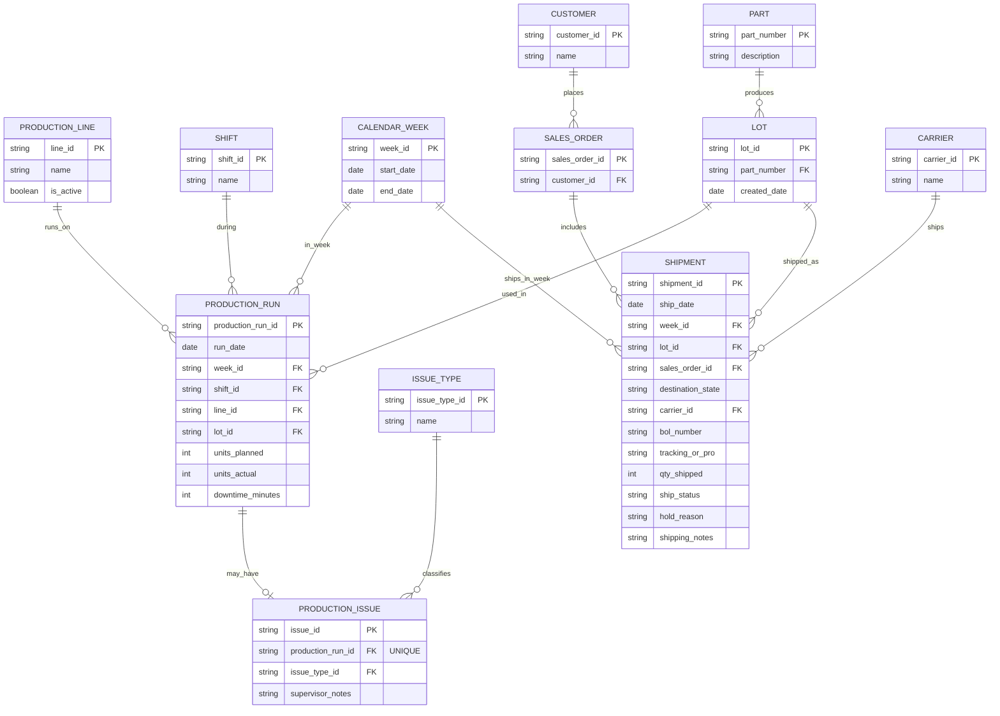

# Data Design (Based on Production + Shipping Logs)

This ERD is based on the provided **Production Log** and **Shipping Log** data. fileciteturn0file0 fileciteturn0file1

---

## Entities and Attributes

### ProductionLine
- `line_id` (PK)
- `name` *(e.g., “Line 1”, “Line 4”)*
- `is_active` *(optional)*

### Shift
- `shift_id` (PK)
- `name` *(Day | Night | Swing)*

### CalendarWeek
- `week_id` (PK) *(e.g., `2026-W03`)*
- `start_date`
- `end_date`

> **Note:** Week can be derived from dates, but storing a `week_id` ensures consistent weekly reporting.

### Part
- `part_number` (PK) *(e.g., `SW-6899-B`)*
- `description` *(optional)*

### Lot
- `lot_id` (PK) *(string, as shown in logs; formatting varies)*
- `part_number` (FK → Part)
- `created_date` *(optional)*

### ProductionRun
Represents one row in the production log (a specific run/record for a lot on a line/shift/date). fileciteturn0file0
- `production_run_id` (PK)
- `run_date`
- `week_id` (FK → CalendarWeek)
- `shift_id` (FK → Shift)
- `line_id` (FK → ProductionLine)
- `lot_id` (FK → Lot)
- `units_planned`
- `units_actual`
- `downtime_minutes`

### IssueType
Derived from “Primary Issue” values (examples: Material shortage, Changeover delay, Tool wear, Sensor fault, Operator training, Quality hold). fileciteturn0file0
- `issue_type_id` (PK)
- `name`

### ProductionIssue
Represents the presence of an issue for a production run when “Line Issue?” is Yes, with optional notes. fileciteturn0file0
- `issue_id` (PK)
- `production_run_id` (FK → ProductionRun, UNIQUE)
- `issue_type_id` (FK → IssueType)
- `supervisor_notes` *(optional)*

### Customer
- `customer_id` (PK)
- `name`

### Carrier
- `carrier_id` (PK)
- `name`

### SalesOrder
- `sales_order_id` (PK) *(e.g., `SO-52588`)*
- `customer_id` (FK → Customer)

### Shipment
Represents one shipment record for a lot. fileciteturn0file1
- `shipment_id` (PK)
- `ship_date`
- `week_id` (FK → CalendarWeek)
- `lot_id` (FK → Lot)
- `sales_order_id` (FK → SalesOrder)
- `destination_state`
- `carrier_id` (FK → Carrier)
- `bol_number` *(optional)*
- `tracking_or_pro` *(optional)*
- `qty_shipped`
- `ship_status` *(e.g., Shipped, Partial, On Hold, Backordered)*
- `hold_reason` *(optional; e.g., Quality hold, Paperwork missing, Carrier delay, Customer request)*
- `shipping_notes` *(optional)*

---

## Relationships (Summary)

- **ProductionLine** 1 ── * **ProductionRun**
- **Shift** 1 ── * **ProductionRun**
- **CalendarWeek** 1 ── * **ProductionRun**
- **Part** 1 ── * **Lot**
- **Lot** 1 ── * **ProductionRun**
- **ProductionRun** 0..1 ── 1 **ProductionIssue**
- **IssueType** 1 ── * **ProductionIssue**
- **Lot** 1 ── * **Shipment**
- **CalendarWeek** 1 ── * **Shipment**
- **Customer** 1 ── * **SalesOrder**
- **SalesOrder** 1 ── * **Shipment**
- **Carrier** 1 ── * **Shipment**

---

## Mermaid ERD (mermaid.js)

