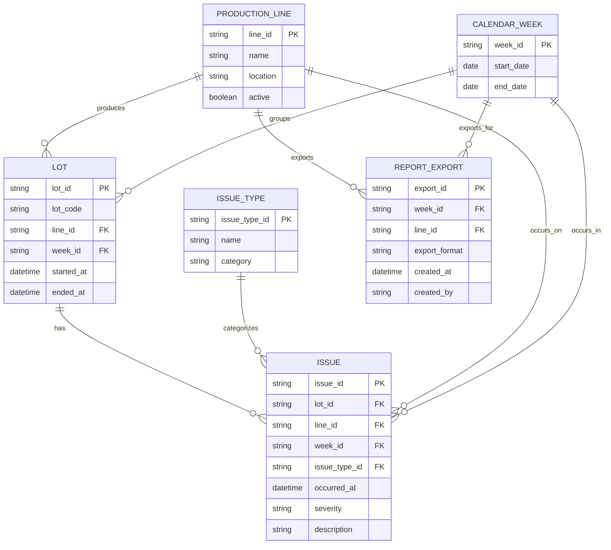

# Data Design (Operations Issues Reporting)

This document derives data entities + relationships from the **Operations user story** and **Acceptance Criteria**:

**User Story**  
As an operations analyst, I want to pull consistent numbers about issues (by week and production line) and identify affected lots, so that I can respond quickly and confidently when leadership asks for updates.

**Acceptance Criteria (summary)**  
- Pick a **week** and a **production line**  
- Show **consistent issue totals** for that selection  
- Show **affected lots** for that week + line  
- Allow **filter/group** by week and line (no manual calculations)  
- Allow **export** of the summary + affected lots

---

## AI #1 extraction (focus: reporting + aggregation)

### Entities
- **ProductionLine**
  - `line_id` (PK)
  - `line_name`
  - `location` *(optional)*
  - `active`

- **CalendarWeek**
  - `week_id` (PK) — format like `YYYY-WW`
  - `start_date`
  - `end_date`

- **Lot**
  - `lot_id` (PK)
  - `lot_code` *(human-friendly identifier)*
  - `line_id` (FK → ProductionLine)
  - `week_id` (FK → CalendarWeek)
  - `started_at` *(optional)*
  - `ended_at` *(optional)*

- **IssueEvent**
  - `issue_id` (PK)
  - `line_id` (FK → ProductionLine)
  - `week_id` (FK → CalendarWeek)
  - `lot_id` (FK → Lot)
  - `issue_type` *(string)*
  - `occurred_at`
  - `severity` *(optional)*
  - `notes` *(optional)*

### Relationships
- ProductionLine **1—M** Lot
- CalendarWeek **1—M** Lot
- Lot **1—M** IssueEvent
- ProductionLine **1—M** IssueEvent
- CalendarWeek **1—M** IssueEvent

**Why this helps:** weekly totals are fast (group by `week_id`, `line_id`), and affected lots come from distinct `lot_id`.

---

## AI #2 extraction (focus: traceability + clean normalization)

### Entities
- **ProductionLine**
  - `line_id` (PK)
  - `name`
  - `plant` *(optional)*

- **Lot**
  - `lot_id` (PK)
  - `lot_code`
  - `produced_on_line_id` (FK → ProductionLine)
  - `produced_at` *(timestamp range or start/end)*

- **Issue**
  - `issue_id` (PK)
  - `lot_id` (FK → Lot)
  - `line_id` (FK → ProductionLine)
  - `issue_type_id` (FK → IssueType)
  - `created_at`
  - `description` *(optional)*

- **IssueType**
  - `issue_type_id` (PK)
  - `name`
  - `category` *(optional)*

- **ReportExport**
  - `export_id` (PK)
  - `week_key` *(string like `YYYY-WW`)*
  - `line_id` (FK → ProductionLine)
  - `export_format` *(csv/pdf/xlsx)*
  - `created_at`

### Relationships
- ProductionLine **1—M** Lot
- Lot **1—M** Issue
- IssueType **1—M** Issue
- ProductionLine **1—M** Issue
- ProductionLine **1—M** ReportExport

**Why this helps:** `IssueType` avoids inconsistent free-text issue types; `ReportExport` supports the “export results” requirement.

---

## Comparison (what each AI did better)

- **AI #1 did better**
  - Modeled **CalendarWeek** explicitly (clear weekly reporting boundaries).
  - Included `week_id` directly on the issue record for **simple aggregation** and “consistent totals”.

- **AI #2 did better**
  - Normalized issue typing via **IssueType** (prevents messy `issue_type` strings).
  - Added **ReportExport** for the export requirement and auditing.

---

## Final merged data model

### Entities & attributes

#### ProductionLine
- `line_id` (PK)
- `name`
- `location` *(optional)*
- `active`

#### CalendarWeek
- `week_id` (PK) — `YYYY-WW`
- `start_date`
- `end_date`

#### Lot
- `lot_id` (PK)
- `lot_code`
- `line_id` (FK → ProductionLine)
- `week_id` (FK → CalendarWeek)
- `started_at` *(optional)*
- `ended_at` *(optional)*

#### IssueType
- `issue_type_id` (PK)
- `name`
- `category` *(optional)*

#### Issue
- `issue_id` (PK)
- `lot_id` (FK → Lot)
- `line_id` (FK → ProductionLine)
- `week_id` (FK → CalendarWeek)
- `issue_type_id` (FK → IssueType)
- `occurred_at`
- `severity` *(optional)*
- `description` *(optional)*

#### ReportExport *(optional but recommended for auditability)*
- `export_id` (PK)
- `week_id` (FK → CalendarWeek)
- `line_id` (FK → ProductionLine)
- `export_format` *(csv/pdf/xlsx)*
- `created_at`
- `created_by` *(optional)*

### Relationships (final)
- ProductionLine **1—M** Lot
- CalendarWeek **1—M** Lot
- Lot **1—M** Issue
- IssueType **1—M** Issue
- ProductionLine **1—M** Issue
- CalendarWeek **1—M** Issue
- ProductionLine **1—M** ReportExport
- CalendarWeek **1—M** ReportExport

**How this satisfies the requirements**
- **Issue totals by week + line:** aggregate `Issue` by (`week_id`, `line_id`).
- **Affected lots:** distinct `Issue.lot_id` for a given (`week_id`, `line_id`).
- **Consistency:** totals come from one canonical table (`Issue`), with stable keys.
- **Export:** `ReportExport` provides traceability for what was exported and when.

---

## Mermaid.js ERD (final)

